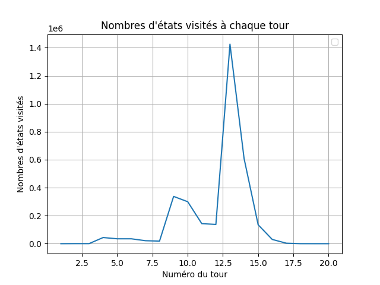

# Rapport INF8175 : Skypiea 

Equipe Challonge : **Orque des Tranchées** _Stephen Cohen - 2412336; Alicia Shao - 2409849_

- [Rapport INF8175 : Skypiea](#rapport-inf8175--skypiea)
- [Introduction](#introduction)
- [Cheminement](#cheminement)
- [Notre agent : Skypiea\_v5](#notre-agent--skypiea_v5)
    - [Heuristique](#heuristique)
    - [Implémentation](#implémentation)
  - [Performances](#performances)
    - [Performances de jeu](#performances-de-jeu)
  - [Nombre d'états visités et profondeur dynamique](#nombre-détats-visités-et-profondeur-dynamique)
  - [Limites](#limites)
  - [Avantages](#avantages)
  - [Pistes d'améliorations](#pistes-daméliorations)
- [Conclusion](#conclusion)
- [Annexes](#annexes)
  - [Code de l'agent final : Skypiea\_v5](#code-de-lagent-final--skypiea_v5)
  - [Code du minimax](#code-du-minimax)
  - [Code de l'alpha-beta prunning](#code-de-lalpha-beta-prunning)
  - [Code Impel Down](#code-impel-down)


<div style="page-break-after: always;"></div>

# Introduction 

Dans ce rapport, nous allons présenter le cheminement aboutissant à notre agent final pour le projet du cours Intelligence artificielle: méthodes et algorithmes, centré cette année sur le jeu de société Divercité.

# Cheminement 

Dans un premier temps, un algorithme _minimax_ a été mis en place,  un  _alpha-bêta pruning_ y a été ensuite ajouté. Enfin, la possibilité d'un Monte-Carlo Tree Search (MCTS) a été également explorée.

Les codes Python du _minimax_ et de l'_alpha-bêta pruning_ sont disponibles en annexe.

- **_Minimax_ :** Cette implémentation est disponible sous les noms d'agents : `Water_seven` et `little_garden` sur Abyss. 
Dans les deux cas, _la profondeur de recherche est fixée à 3_ pour **respecter la contrainte de temps imposée**. Avec ce paramètre, il reste environ 100 s à la fin de la partie. La différence entre les deux agents réside dans l'heuristique choisie : 
  - L'heuristique de `little_garden` est la suivante : ```player_score - opponent_score```. On cherche à maximiser l'écart de points en notre faveur. Cependant, cette heuristique n'est pas assez précise, elle peut favoriser des divercités pour l'adversaire.
  - La seconde, celle de `Water_seven`, tient compte des observations faites lors de nos sessions de jeu. Placer des cités en fin de partie est défavorable, alors que les ressources permettent de finir des divercités ou de bloquer celles de l'adversaire. Ainsi, on pénalise le choix de jouer une cité au fil de la partie et on favorise le choix de ressources. Nous aboutissons à l'heuristique suivante : ```player_score - opponent_score + (1 - 2 * state.step/40) * nb_cite + (1 + 4 * state.step/40) * nb_ressource```.
  **En plus de l'écart entre les points, nous rajoutons donc un paramètre qui tient compte de l'ensemble des coups disponibles (ressources ou cités).**

- **_Alpha-bêta pruning_ :** Cette implémentation est disponible dans les agents : `Enies_Lobby` et `skypiea_vX`. 
L'avantage de l'_alpha-bêta pruning_réside dans le gain de temps obtenu grâce à l'élagage. Ce temps supplémentaire est réinvesti au profit d'une recherche plus profonde. **Attention :** On remarque qu'une grande profondeur couplée à une mauvaise heuristique propage de mauvais résultats, ce qui entraine une dégradation significative des résultats de l'agent (notamment avec `skypiea` avec l'heuristique classique).
    - **La profondeur est dynamique en fonction de l'avancée de la partie**. En effet, une _recherche profonde en début de partie représente un investissement de temps peu rentable pour un coup peu décisif_. Ainsi, le **premier coup est joué de manière aléatoire parmi les coups jouant des cités**, ce qui permet de gagner 100 à 200 s de jeu : 
    <!-- ```
        # Pré-choisir une action si on joue en premier
        if current_state.get_step() < 2:
            possible_actions = current_state.get_possible_light_actions()
            return random.choice(list(possible_actions))
    ``` -->
    ```
         # Pré-choisir une action si on joue en premier
        if current_state.get_step() < 2:
            possible_actions = current_state.get_possible_light_actions()
        # Filtrer pour ne garder que les actions qui placent une cité (RC, GC, BC, YC)
            city_actions = [action for action in possible_actions if action.data["piece"] in ['RC', 'GC', 'BC', 'YC']]
            return random.choice(city_actions)

    ```

    Puis, la profondeur est gérée comme suit afin de conserver environ 60 s en fin de partie :

    ```
    if nb_pieces_1 + nb_pieces_2 >= 35:
                depth = 4
            elif nb_pieces_1 + nb_pieces_2 >= 12:
                depth = 5
            else:
                depth = 6
                
            _, best_action = alpha_beta_minimax(current_state, depth, float('-inf'), float('inf'), True)
    ```
Cette étape d'ajustement de la profondeur abouti à `skypiea_v2`, l'agent le plus performant de la génération _alpha-bêta pruning_. La profondeur est gérée finalement de la manière suivante : 

```
if nb_pieces_1 + nb_pieces_2 >= 12:
                depth = 4
            else:
                depth = 6
```
et l'heuristique est celle-ci : ``` player_score - opponent_score + (1 - 2 * state.step/40) * nb_cite + (1 + 4 * state.step/40) * nb_ressource```

- **MCTS :** Les résultats donnés par notre agent basé uniquement sur un MCTS ne sont pas assez satisfaisants pour mériter une présentation complète du code, il ne bat aucun des agents présentés plus haut. Cependant, nous avons développé un agent combinant _alpha-bêta pruning_ et MCTS de la manière suivante: : 
  - _Sur les 30% du début de jeu, jouer avec un MCTS moins optimal qu'un alpha-bêta pruning mais très rapide_. 
  - Puis, un _alpha-bêta pruning de profondeur progressive de type  5 / 7_. 

L'idée première était d'obtenir rapidement des premiers coups, cohérents, voirs bons pour libérer du temps afin de réaliser une recherche plus profonde dans un deuxième temps. Dans le cas où le MCTS ne propose que des coups incohérents et mauvais, l'effet pourrait être compensé par la deuxième phase, qui engendrait déjà à ce stade des résultats probants.

L'ajustement final des paramètres n'a pas pu être réalisé avant le début du tournoi. Nos agents étaient soit **trop lents** (mais assez compétitifs, sans battre nos agents précédents) ou **trop peu efficaces** (mais rapides). Le code de notre agent hybride est disponible en [annexe](#code-impel-down) sous le nom d'`Impel Down`.

Nous avons donc choisi de perfectionner pour ce projet `skypiea_v2`, un agent _minimax alpha-bêta pruning_ pur.

<div style="page-break-after: always;"></div>

# Notre agent : Skypiea_v5

<!-- ### Choix du type d'algorithme 

Notre agent est très proche de celui de type `skypiea`. C'est-à-dire, un _Minimax Alpha-bêta pruning_ pur.
Nous avons choisi ce type d'algorithme car il présentait les meilleurs résultats entre nos agents.  -->

### Heuristique 

La base de l'heuristique Skypiea_v5 est celle décrite dans la partie _Alpha-bêta Pruning_. Après avoir réalisé des tests pour affiner les coefficients de pénalisation, nous obtenons l'heuristique suivante : ```player_score - opponent_score + (1 - 24 * state.step / 40) * nb_cite + (1 + 27 * state.step / 40) * nb_ressource ```

### Implémentation 

Le code de notre agent est disponible [ici](#code-de-lagent-final--skypiea_v3)

## Performances

### Performances de jeu

Ces statistiques ont été obtenues à partir d'Abyss. On y présente tous les agents qui ont réalisé au moins un match.

| Agents             | Notes                | Elo  | Total matches | Victoires | Défaites | W/L          | Nombre de divercités | NbDivercités/Game | Points marqués | Points concédés | Points marqués/Concédés | Points marqués/Game | Points concédés/Game |
|--------------------|----------------------|------|---------------|-----------|----------|--------------|---------------------|-------------------|----------------|-----------------|-----------------|--------------------|---------------------|
| Skypiea v5         | _Alpha-bêta pruning_   | 1282 | 13            | 10        | 3        | 3,333333333  | 30                  | 2,307692308       | 259            | 201             | 1,288557214     | 19,92307692        | 15,46153846         |
| Impel Down 25000   | MCTS puis _Alpha-bêta pruning_         | 937  | 9             | 6         | 3        | 2            | 22                  | 2,444444444       | 200            | 147             | 1,360544218     | 22,22222222        | 16,33333333         |
| Wano               |                      | 588  | 15            | 2         | 13       | 0,153846154  | 11                  | 0,7333333333      | 213            | 340             | 0,6264705882    | 14,2              | 22,66666667         |
| Impel Down 15000   | MCTS puis _Alpha-bêta pruning_         | 1006 | 1             | 1         | 0        | #DIV/0!      | 5                   | 5                 | 29             | 16              | 1,8125          | 29                 | 16                  |
| Water Seven        |                      | 971  | 1721          | 903       | 818      | 1,10391198   | 1972                | 1,145845439       | 29541          | 28239           | 1,046106449     | 17,16502034        | 16,40848344         |
| Sabondy            |                      | 1108 | 226           | 142       | 84       | 1,69047619   | 291                 | 1,287610619       | 4224           | 3718            | 1,136094675     | 18,69026549        | 16,45132743         |
| Skypiea v2.2       | _Alpha-bêta pruning_   | 1165 | 25            | 17        | 8        | 2,125        | 26                  | 1,04              | 447            | 386             | 1,158031088     | 17,88              | 15,44              |
| Skypiea v2         | _Alpha-bêta pruning_   | 1275 | 489           | 350       | 139      | 2,517985612  | 636                 | 1,300613497       | 9085           | 7472            | 1,215872591     | 18,57873211        | 15,2801636          |
| Little Garden      |                      | 713  | 707           | 337       | 370      | 0,910810811  | 488                 | 0,690240453       | 11860          | 11468           | 1,034182072     | 16,77510608        | 16,22065064         |
| Skypia             |                      | 960  | 5             | 2         | 3        | 0,666666667  | 0                   | 0                 | 91             | 88              | 1,034090909     | 18,2               | 17,6               |

**Remarques :** Le nombre de matches joués par un agent est assez inhomogène, les conclusions suivantes en prennent compte et sont à nuancer.

Le tableau met en évidence la compétitivité des différents agents dans l’environnement Abyss. Voici un commentaire détaillé des résultats :

- Agent Skypiea_v5 (_Alpha-bêta pruning_)
    - Performance globale : Avec un Elo de 1282, l'agent Skypiea_v5 domine la majorité des parties, affichant un ratio victoires/défaites de 3,33 (pour seulement 13 matches cependant)
    - Divercités : Il obtient en moyenne 2,3 divercités par partie, témoignant d’une capacité à exploiter les ressources efficacement, bien que cela soit perfectible.
    - Ratio points marqués/concédés : Le ratio de 1,29 montre une capacité à marquer plus de points que l’adversaire, reflet d’une bonne gestion des ressources et de l’heuristique employée.

- Agent Impel Down (MCTS puis _Alpha-bêta pruning_)
    - Deux versions : Les versions avec 15 000 et 25 000 simulations aléatoires affichent des performances variables. La version 25 000 obtient un Elo de 937, mais l’agent peine à être décisif (ratio W/L de 2) et est davantage soumis au risque de _time out_. (Il est actuallement inactif pour cette même raison).
    - Divercités : Le score moyen de divercités par partie (2,44) est légèrement meilleur que Skypiea_v5, suggérant que l’exploration initiale en MCTS réussit à choisir de meilleurs coups en début de partie que les agents de type Skypiea.

- Agents intermédiaires (Skypiea_v2, Sabondy)
    - Ces deux agents sont de type _Alpha-bêta pruning_ purs montre des stables sur un grand nombre de matches, obtenant respectivement 1275 et 1108 d'Elo.
    - Ces résultats confirment qu'un agent basé  _alpha-bêta pruning_ représente un base solide pour obtenir des résultats probants rapidement et facielement. Cela conforte le choix d'avoir poursuivi l'affinage des agents de type Skypiea.

## Nombre d'états visités et profondeur dynamique

Ci-dessous, un graphique du nombres d'états évalués par Skypiea_v5 en fontion de l'avancée de la partie.



Sur le graphique des états visités, nous observons bien les différentes profondeurs de l'arbre du _minimax_. De plus, notre stratégie qui vise à avoir un milieu de partie très profond est rendu possible grâce à un début de partie très peu profond. 
Voici le nombre d'états visités au fil de la partie : ```[0, 452, 402, 43888, 34809, 34825, 21231, 18401, 337614, 299769, 143075, 137567, 1425242, 608967, 134754, 30259, 3387, 169, 25, 3]```

 - Le premier coup est aléatoire donc 0 
 - La phase de recherche en profondeur 2 : ```[452, 402]```
 - La phase de recherche en profondeur 4 : ```[43888, 34809, 34825, 21231, 18401]```
 - La phase de recherche en profondeur 5 : ```[337614, 299769, 143075, 137567]```
 - La phase de recherche en profondeur 7 : ```[1425242, 608967, 134754, 30259, 3387, 169, 25, 3]```

## Limites 

Outre des _time out_ dès le coup 1 que nous ne comprenons pas, voici les pistes d'amélioration que nous avons identifiées : 

- **L'heuristique :** Notre heuristique ne tient pas compte de **la présence de divercités** ou d'**opportunités de divercités** pour l'agent ou l'agent adverse. En effet, l'agent ne sait à aucun moment combien de ses pièces ou des pièces adverses sont encore capables de réaliser une divercité, ni si elles en sont éloignées. C'est pourquoi, nous pouvons juger une situation plus favorable alors qu'elle nous empêche de réaliser une divercité ou rapproche l'adversaire d'en faire une. C'est d'ailleurs ce que l'on peut observer dans l'étude des performances, nos agents réalisent en moyenne moins de 1,5 divercité par partie.
- **La connaissance des pièces adverses :** Dans Divercité, les joueurs ont connaissance des pièces adverses. Par exemple, savoir que l'adversaire n'a plus de ressources rouges permet de savoir qu'il ne pourra plus faire de divercité. S'il n'a plus de cité, les places de cité disponibles nous reviennent. Il n'y aurait donc plus besoin de les pénaliser, il faudrait même construire des divercités autour des emplacements de cités vides.
- **Le temps de calcul :** L'agent présenté utilise presque l'intégralité du temps disponible (il reste 35 secondes à la fin), sans pourtant présenter des résultats excellents. Cela suggère qu'il est possible d'élaguer davantage d'états, toujours dans l'optique d'augmenter la profondeur de recherche.

## Avantages 

- **L'implémentation :** L'algorithme _minimax_ avec _alpha-Bêta pruning_ n'est pas difficle à implémenter, ce qui facilite le développement et permet d'avoir une phase de tests beaucoup plus longue permettant d'ajuster l'heuristique par rapport à un algorithme plus complexe à mettre en place. 
- **Les performances :** Le ratio entre la performance et la difficulté d'implémentation est excellent pour Skypiea_v5 et les autres agents de sa famille. A titre de comparaison, les agents hybrides avec un MCTS sont prometteurs mais nécessitent l'ajustement complexe de plusieurs autres paramètres (nombre de simulations totales, choix entre simulations aléatoires ou guidées par une heuristique, choix du moment de passage à l'_alpha-bêta pruning_) sans garantie d'amélioration substantive.


## Pistes d'améliorations  

- **L'heuristique :** L’heuristique actuelle peut-être enrichie avec des facteurs comme le contrôle des zones stratégiques, la proximité de réalisation des divercités, et les blocages potentiels pour l’adversaire. Cela permet une prise de décisions plus stratégiques en fonction du contexte du jeu, surtout lors de phases plus critiques. 
- **La réduction du temps de calcul :** 
  - On pourrait **stocker les évaluations des états déjà visités** pour éviter de recalculer des scénarios redondants. L’utilisation d’une table de transposition permet d’accélérer les recherches, notamment dans les configurations de jeu symétriques. Pour se faire, on peut utiliser des hashcodes d'états pour les identifier efficacement; tout en tenant compte des symétries du plateau pour réduire de manière significative les répétitions de calcul. 
  - Une stratégie de **_Late Move Reduction_** peut également être mise en place. Elle consiste à réduire la profondeur de recherche sur les coups explorés tardivement dans une branche, en supposant que les premiers coups sont généralement les meilleurs. 
  - Une autre piste d'amélioration est de **gérer de temps de manière adaptive en fonction du temps restant**. Il s'agit de limiter la profondeur ou d’interrompre des branches si le temps alloué pour un coup est proche de l’expiration.
- **Tenir compte de l'historique de nos parties :** Via une exploration bayésienne des actions, on pourrait ajuster la probabilité de sélection des actions en fonction de leur performance dans des simulations précédentes. 


# Conclusion 

Ainsi, notre équipe a développé un agent pour Divercité de type _alpha-bêta pruning_ plutôt performant, fruit d'un processus itératif formé par trois générations d'agents. 

L'heuristique employée met l'accent non seulement sur le score de la partie, mais prend également en compte des stratégies développées lors des sessions de jeu réelles en favorisant le coups impliquant des cités et en pénalisant les coups impliquant des ressources en _early game_. 

L'heuristique et le type d'algorithme choisis ayant obtenu des résultats probants très tôt, le principal enjeu et défi de ce projet aura donc été d'augmenter la profondeur de recherche dans l'algorithme afin d'améliorer ces résultats, tout en tenant compte de la contrainte de temps. 

Plusieurs approches ont été employées pour y répondre, dont une profondeur dynamique en fonction de l'avancée de la partie, pour favoriser la recherche d'états favorables en milieu de jeu, identifié comme le moment décisif d'une partie.

L'idée d'un agent hybride MCTS-_alpha-bêta pruning_, qui apporte une réponse différente à ce problème, n'a pas été retenue. Elle demeure cependant une approche prometteuse mais plus complexe, nécessitant davantage d'investissment pour l'ajuster, l'affiner et l'améliorer.

Finalement, à travers ce projet, nous avons mis en pratique plusieurs algorithmes de recherche adversarielle dans un cadre applicatif stimulant et ludique. Cette expérience mettant à profit nos capacités analytiques a nécessité la mise en place d'une réelle démarche de recherche collaborative, enrichissant ainsi notre bagage scientifique et nos compétences interpersonnelles.

<div style="page-break-after: always;"></div>

# Annexes 

## Code de l'agent final : Skypiea_v5

```
import random
from functools import lru_cache
from seahorse.game.action import Action
from seahorse.game.game_state import GameState
from player_divercite import PlayerDivercite

class MyPlayer(PlayerDivercite):
    def __init__(self, piece_type: str, name: str = "AlphaBetaOptimized"):
        super().__init__(piece_type, name)

    def compute_action(self, current_state: GameState, **kwargs) -> Action:
        if current_state.get_step() < 2:
            possible_actions = current_state.get_possible_light_actions()
            city_actions = [action for action in possible_actions if action.data["piece"] in ['RC', 'GC', 'BC', 'YC']]
            return random.choice(city_actions)

        # Calcul de la profondeur en fonction des pièces restantes
        depth = self.calculate_depth(current_state)
        _, best_action = self.alpha_beta_minimax(current_state, depth, float('-inf'), float('inf'), True)
        return best_action

    def calculate_depth(self, state: GameState) -> int:
        players = state.players
        dic_player_pieces = state.players_pieces_left
        pieces = ['RC', 'RR', 'GC', 'GR', 'BC', 'BR', 'YC', 'YR']
        total_pieces = sum(dic_player_pieces[p.get_id()][p_type] for p in players for p_type in pieces)

        if total_pieces >= 35:
            return 2
        elif total_pieces >= 24:
            return 4
        elif total_pieces >= 16:
            return 5
        else:
            return 7

    def alpha_beta_minimax(self, state: GameState, depth: int, alpha: float, beta: float, maximizing_player: bool):
        if depth == 0 or state.is_done():
            return self.evaluate_state_cached(state), None

        actions = state.get_possible_light_actions()
        if len(actions) > 5:
            actions = sorted(actions, key=lambda a: self.evaluate_state_cached(state.apply_action(a)), reverse=maximizing_player)

        best_action = None
        if maximizing_player:
            max_eval = float('-inf')
            for action in actions:
                next_state = state.apply_action(action)
                eval, _ = self.alpha_beta_minimax(next_state, depth - 1, alpha, beta, False)
                if eval > max_eval:
                    max_eval = eval
                    best_action = action
                alpha = max(alpha, eval)
                if beta <= alpha:
                    break
            return max_eval, best_action
        else:
            min_eval = float('inf')
            for action in actions:
                next_state = state.apply_action(action)
                eval, _ = self.alpha_beta_minimax(next_state, depth - 1, alpha, beta, True)
                if eval < min_eval:
                    min_eval = eval
                    best_action = action
                beta = min(beta, eval)
                if beta <= alpha:
                    break
            return min_eval, best_action

    @lru_cache(maxsize=5000)
    def evaluate_state_cached(self, state: GameState) -> float:
        return self.evaluate_state(state)

    def evaluate_state(self, state: GameState) -> float:
        player_id = self.get_id()
        player_score = state.scores[player_id]
        opponent_score = sum(score for pid, score in state.scores.items() if pid != player_id)

        dic_pieces = state.players_pieces_left[player_id]
        nb_cite = sum(dic_pieces[c] for c in ['RC', 'GC', 'BC', 'YC'])
        nb_ressource = sum(dic_pieces[r] for r in ['RR', 'GR', 'BR', 'YR'])

        return (
            player_score - opponent_score
            + (1 - 24 * state.step / 40) * nb_cite
            + (1 + 24 * state.step / 40) * nb_ressource
        )
```

## Code du minimax 

Voici le code utilisé pour le minimax pur : 

```
def minimax(state: GameState, depth: int, maximizing_player: bool) -> float:
            if depth == 0 or state.is_done():
                return self.evaluate_state(state), None

            if maximizing_player:
                max_eval = float('-inf')
                for action in state.get_possible_light_actions():
                    next_state = state.apply_action(action)
                    eval, _ = minimax(next_state, depth - 1, False)
                    if eval > max_eval : 
                        max_eval = eval
                        best_action = action
                return max_eval, best_action
            else:
                min_eval = float('inf')
                for action in state.get_possible_light_actions():
                    next_state = state.apply_action(action)
                    eval, _  = minimax(next_state, depth - 1, True)
                    if eval < min_eval:
                        min_eval = eval
                        best_action = action
                return min_eval, best_action 

        if current_state.get_step() < 2:
            possible_actions = current_state.get_possible_light_actions()
            return random.choice(list(possible_actions))
        else : 
            # Ajustement de la profondeur en fonction du nombre de pièces restantes
            players = current_state.players
            players_id = [p.get_id() for p in players]
            dic_player_pieces = current_state.players_pieces_left
            dic_pieces_1 = dic_player_pieces[players_id[0]]
            dic_pieces_2 = dic_player_pieces[players_id[1]]
            pieces = ['RC', 'RR', 'GC', 'GR', 'BC', 'BR', 'YC', 'YR']
            nb_pieces_1, nb_pieces_2 = sum(dic_pieces_1[p] for p in pieces), sum(dic_pieces_2[p] for p in pieces)

            # Modifier la profondeur en fonction du nombre de pièces restantes
            '''
            if nb_pieces_1 + nb_pieces_2 >= 22:
                depth = 3
            elif nb_pieces_1 + nb_pieces_2 >= 12:
                depth = 4
            else:
                depth = 5
            best_action = None
            # best_value = float('-inf')
            '''
            _ , best_action = minimax(current_state, 3, True)  ################### Ici pour changer la profondeur et mettre à True car on veut maximiser

            return best_action
```

## Code de l'alpha-beta prunning

```
def compute_action(self, current_state: GameState, **kwargs) -> Action:
        """
        Use the minimax algorithm with alpha-beta pruning to choose the best action.
        """
        def alpha_beta_minimax(state: GameState, depth: int, alpha: float, beta: float, maximizing_player: bool) -> float:
            if depth == 0 or state.is_done():
                return self.evaluate_state(state), None

            if maximizing_player:
                max_eval = float('-inf')
                best_action = None
                actions = state.get_possible_light_actions()

                # Ne trie que si le nombre d'actions est assez grand
                if len(actions) > 5:
                    actions = sorted(actions, key=lambda a: self.evaluate_state(state.apply_action(a)), reverse=True)

                for action in actions:
                    next_state = state.apply_action(action)
                    eval, _ = alpha_beta_minimax(next_state, depth - 1, alpha, beta, False)
                    if eval > max_eval:
                        max_eval = eval
                        best_action = action
                    alpha = max(alpha, eval)
                    if beta <= alpha:
                        break  
                return max_eval, best_action 
            else:
                min_eval = float('inf')
                best_action = None
                actions = state.get_possible_light_actions()

                if len(actions) > 5:
                    actions = sorted(actions, key=lambda a: self.evaluate_state(state.apply_action(a)))

                for action in actions:
                    next_state = state.apply_action(action)
                    eval, _ = alpha_beta_minimax(next_state, depth - 1, alpha, beta, True)
                    if eval < min_eval:
                        min_eval = eval
                        best_action = action
                    beta = min(beta, eval)
                    if beta <= alpha:
                        break
                return min_eval, best_action

        # Pré-choisir une action si on joue en premier
        if current_state.get_step() < 2:
            possible_actions = current_state.get_possible_light_actions()
            return random.choice(list(possible_actions))

        else:
        # Ajustement de la profondeur en fonction du nombre de pièces restantes
            players = current_state.players
            players_id = [p.get_id() for p in players]
            dic_player_pieces = current_state.players_pieces_left
            dic_pieces_1 = dic_player_pieces[players_id[0]]
            dic_pieces_2 = dic_player_pieces[players_id[1]]
            pieces = ['RC', 'RR', 'GC', 'GR', 'BC', 'BR', 'YC', 'YR']
            nb_pieces_1, nb_pieces_2 = sum(dic_pieces_1[p] for p in pieces), sum(dic_pieces_2[p] for p in pieces)

            # Modifier la profondeur en fonction du nombre de pièces restantes
            
            # Fonctionne plus rapidement 
            '''
            if nb_pieces_1 + nb_pieces_2 >= 35:
                depth = 3
            elif nb_pieces_1 + nb_pieces_2 >= 12:
                depth = 4
            else:
                depth = 6
            '''

            if nb_pieces_1 + nb_pieces_2 >= 35:
                depth = 2
            elif nb_pieces_1 + nb_pieces_2 >= 12:
                depth = 5
            else:
                depth = 7
                
            _, best_action = alpha_beta_minimax(current_state, depth, float('-inf'), float('inf'), True)
            return best_action
```

## Code Impel Down

```
import random
from seahorse.game.action import Action
from seahorse.game.game_state import GameState
from player_divercite import PlayerDivercite
import math

class TreeNode:
    def __init__(self, state : GameState, max_root_children = -1, parent=None):
        self.state = state
        self.parent = parent
        self.max_root_children = max_root_children 
        self.children = {}
        self.visits = 0
        self.value = 0.0

    def is_fully_expanded(self):
        """ Check if all possible actions have been expanded. """
        if (self.parent == None and self.max_root_children > -1) :
            return len(self.children) == self.max_root_children
        else: 
            return len(self.children) == len(self.state.get_possible_light_actions())

    def uct_value(self, exploration_constant=math.sqrt(2)):
        """ Calculate the UCT value for this node. """
        if self.visits == 0:
            return float('inf')  # Ensure unvisited nodes are prioritized
        exploitation = self.value / self.visits
        exploration = exploration_constant * math.sqrt(math.log(self.parent.visits) / self.visits)
        return exploitation + exploration

    def best_child(self, exploration_constant=math.sqrt(2)):
        """ Select the child with the highest UCT value. """
        return max(self.children.values(), key=lambda child: child.uct_value(exploration_constant))

    def expand(self):
        """ Expand by adding a child for an untried action. """
        actions = self.state.get_possible_light_actions()
        untried_actions = [a for a in actions if a not in self.children]
        action = random.choice(untried_actions)
        next_state = self.state.apply_action(action)
        child_node = TreeNode(next_state, parent=self)
        self.children[action] = child_node
        return child_node

    def update(self, outcome):
        """ Update node statistics on backpropagation. """
        self.visits += 1
        self.value += outcome

    def select(self):
        """ Traverse the tree using UCT until reaching a leaf node. """
        node = self
        while not node.isLeaf() and node.is_fully_expanded():
            node = node.best_child()
        return node

    def isLeaf(self):
        """ Check if this node is a leaf (has no children). """
        return len(self.children) == 0
    
class MyPlayer(PlayerDivercite):
    """
    Player class for Divercite game that uses the Minimax algorithm with alpha-beta pruning and MCTS for the first 10 moves.
    """

    def __init__(self, piece_type: str, name: str = "AlphaBetaPlayer"):
        super().__init__(piece_type, name)

    def mcts(self, state: GameState, simulations: int = 1000) -> Action:      ### Attention que 1000 simulations peut-être pas assez
        """ Perform MCTS to determine the best action. """
        action_counts = {action: 0 for action in state.get_possible_light_actions()}
        action_values = {action: 0 for action in state.get_possible_light_actions()}

        for _ in range(simulations):
            # Convert possible actions to a list
            possible_actions_list = list(action_counts.keys())
            action = random.choice(possible_actions_list)
            next_state = state.apply_action(action)

            # Simulate the game to completion from the next state
            while not next_state.is_done():
                possible_actions = next_state.get_possible_light_actions()
                # Convert possible actions to a list
                possible_actions_list = list(possible_actions)
                random_action = random.choice(possible_actions_list)
                next_state = next_state.apply_action(random_action)

            # Use the evaluation function to determine the outcome of the simulation
            outcome = self.evaluate_state(next_state)
            action_counts[action] += 1
            action_values[action] += outcome

        # Calculate average values and choose the best action
        best_action = max(action_values, key=lambda a: action_values[a] / action_counts[a])
        return best_action
    
    def simpleSimulation(self, node):
        current_state = node.state
        while not current_state.is_done():
            possible_actions = list(current_state.get_possible_light_actions())
            action = random.choice(possible_actions)
            current_state = current_state.apply_action(action)
        return self.evaluate_state(current_state)

    def heuristicsSimulation(self, node):
        current_state = node.state
        while not current_state.is_done():
            possible_actions = list(current_state.get_possible_light_actions())
        
            # Evaluate each possible next state
            action_scores = []
            for action in possible_actions:
                next_state = current_state.apply_action(action)
                score = self.evaluate_state(next_state)
                action_scores.append((action, score))
    
            # Calculate the total score for normalization
            total_score = sum(score for _, score in action_scores)
    
            if total_score > 0:
            # Weighted random choice based on normalized probabilities
                probabilities = [score / total_score for _, score in action_scores]
                action = random.choices([a for a, _ in action_scores], weights=probabilities, k=1)[0]
            else:
                # Fallback to uniform random choice if all scores are zero
                action = random.choice(possible_actions)
    
            # Apply the chosen action
            current_state = current_state.apply_action(action)

        return self.evaluate_state(current_state)

    def mcts_taylorsVersion(self, state : GameState, simple, max_root_children = -1, simulation = 1000):
        treePaine = TreeNode(state, max_root_children)
        if treePaine.parent == None and max_root_children > 0:
            actions = state.get_possible_light_actions()
            actions = sorted(actions, key=lambda a: self.evaluate_state(state.apply_action(a)), reverse=True)[:max_root_children]
            treePaine.children = {action: TreeNode(state.apply_action(action), parent=treePaine) for action in actions}
        for _ in range(simulation):
            print(f"\rMCTS Iteration: {_ + 1}/{simulation}, root children: {len(treePaine.children)}", end='', flush=True)
            if _ == simulation - 1:
                print("\n")
            #Select 
            node = treePaine.select()

            # 2. Expansion
            if not node.state.is_done() and not node.is_fully_expanded():
                node = node.expand()

            outcome = 0
            if simple:
                outcome = self.simpleSimulation(node)
            else:
                outcome = self.heuristicsSimulation(node)

            # Backpropagate
            while node:
                node.update(outcome)
                node = node.parent

        # Choose the action leading to the best child
        best_action = max(treePaine.children.items(), key=lambda item: item[1].visits)[0]
        return best_action
    
    def alpha_beta_minimax(self, state: GameState, depth: int, alpha: float, beta: float, maximizing_player: bool) -> float:
        if depth == 0 or state.is_done():
            return self.evaluate_state(state), None

        if maximizing_player:
            max_eval = float('-inf')
            best_action = None
            actions = state.get_possible_light_actions()

            # Ne trie que si le nombre d'actions est assez grand
            if len(actions) > 5:
                actions = sorted(actions, key=lambda a: self.evaluate_state(state.apply_action(a)), reverse=True)

            for action in actions:
                next_state = state.apply_action(action)
                eval, _ = self.alpha_beta_minimax(next_state, depth - 1, alpha, beta, False)
                if eval > max_eval:
                    max_eval = eval
                    best_action = action
                alpha = max(alpha, eval)
                if beta <= alpha:
                    break  # Coupure
            return max_eval, best_action  # Return value and best action
        else:
            min_eval = float('inf')
            best_action = None
            actions = state.get_possible_light_actions()

            if len(actions) > 5:
                actions = sorted(actions, key=lambda a: self.evaluate_state(state.apply_action(a)))

            for action in actions:
                next_state = state.apply_action(action)
                eval, _ = self.alpha_beta_minimax(next_state, depth - 1, alpha, beta, True)
                if eval < min_eval:
                    min_eval = eval
                    best_action = action
                beta = min(beta, eval)
                if beta <= alpha:
                    break  # Coupure
            return min_eval, best_action  # Return value and best action

    def greedy(self, state):
        possible_actions = state.generate_possible_heavy_actions()
        best_action = next(possible_actions)
        best_score = best_action.get_next_game_state().scores[self.get_id()]
        for action in possible_actions:
            state = action.get_next_game_state()
            score = state.scores[self.get_id()]
            if score > best_score:
                best_action = action
        return best_action

    def compute_action(self, current_state: GameState, **kwargs) -> Action:
        """
        Compute action using MCTS for the first 10 moves, then alpha-beta pruning.
        """

        if current_state.get_step() < 2:
            return self.greedy(current_state)
        # Utiliser MCTS pour les 10 premiers coups
        if current_state.get_step() < 10:
### Attention j'ai modifié ta version ici 
            #return self.mcts_taylorsVersion(current_state, True, 10, 20000)
            return self.mcts_taylorsVersion(current_state, True, 10, 15000)
        # Pour les coups suivants, utiliser alpha-beta
        else:
            players = current_state.players
            players_id = [p.get_id() for p in players]
            dic_player_pieces = current_state.players_pieces_left
            dic_pieces_1 = dic_player_pieces[players_id[0]]
            dic_pieces_2 = dic_player_pieces[players_id[1]]
            pieces = ['RC', 'RR', 'GC', 'GR', 'BC', 'BR', 'YC', 'YR']
            nb_pieces_1, nb_pieces_2 = sum(dic_pieces_1[p] for p in pieces), sum(dic_pieces_2[p] for p in pieces)

            # Ajuster la profondeur en fonction du nombre de pièces restantes
            if nb_pieces_1 + nb_pieces_2 >= 12:
                depth = 4
            else:
                depth = 6
            
            _, best_action = self.alpha_beta_minimax(current_state, depth, float('-inf'), float('inf'), True)
            return best_action

    def evaluate_state(self, state: GameState) -> float:
        """
        Evaluate the game state and return a heuristic value.
        """
        players = state.players
        players_id = [p.get_id() for p in players]
        player_id = self.get_id()

        player_score = state.scores[self.get_id()]
        opponent_score = state.scores[players_id[0]] if players_id[0] != player_id else state.scores[players_id[1]]
        
        dic_player_pieces = state.players_pieces_left
        dic_pieces_1 = dic_player_pieces[player_id]
        cite = ['RC', 'GC', 'BC', 'YC']
        ressource = ['RR', 'GR', 'BR', 'YR']
        nb_cite, nb_ressource = sum(dic_pieces_1[c] for c in cite), sum(dic_pieces_1[r] for r in ressource)
        
        return player_score - opponent_score + (1 - 4 * state.step / 40) * nb_cite + (1 + 4 * state.step / 40) * nb_ressource
```